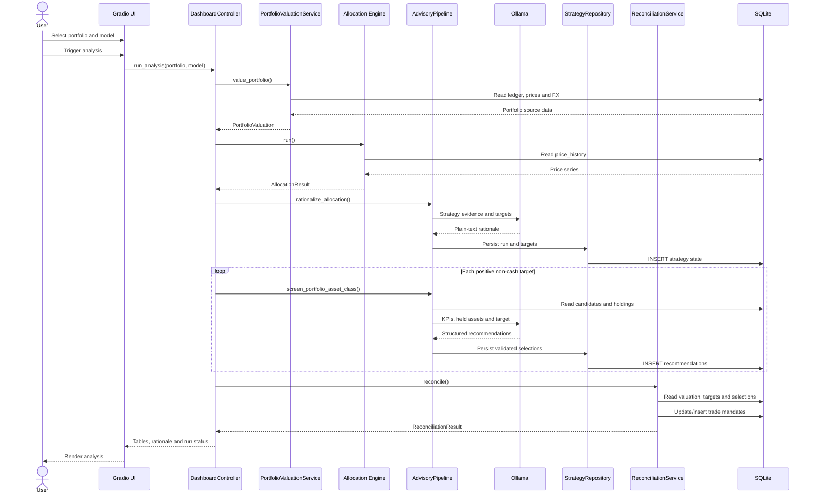
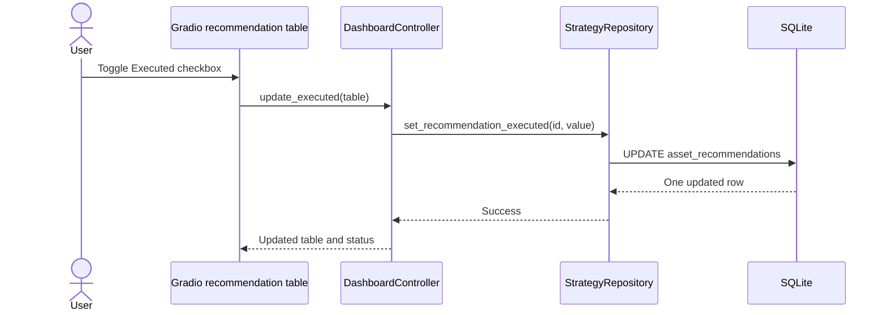

# Stratos Quant Architecture

This document describes the implemented Stratos Quant architecture, the
responsibilities of each component, and how data moves through a complete
portfolio analysis run.

## 1. Architectural overview

Stratos Quant is a local, layered Python application:

```text
┌─────────────────────────────────────────────────────────────────────┐
│ Presentation                                                        │
│ Gradio Blocks + DashboardController                                 │
├─────────────────────────────────────────────────────────────────────┤
│ Application services                                                │
│ AdvisoryPipeline + ReconciliationService                            │
├───────────────────────────┬─────────────────────────────────────────┤
│ Deterministic domain      │ Local advisory                          │
│ Portfolio valuation       │ OllamaClient                            │
│ Allocation engines        │ Prompt construction and validation      │
│ Drift and trade sizing    │                                         │
├───────────────────────────┴─────────────────────────────────────────┤
│ Data access                                                         │
│ SQLAlchemy queries + StrategyRepository + PriceHistoryLoader        │
├───────────────────────────┬─────────────────────────────────────────┤
│ SQLite                    │ Ollama HTTP API                          │
│ Portfolio and run state   │ Local model inference                   │
└───────────────────────────┴─────────────────────────────────────────┘
```

The central design rule is:

> Mathematics determines allocation and trade sizes. The LLM explains the
> allocation and selects securities from a validated candidate set.

Ollama does not calculate portfolio weights, prices, FX conversions, drift, or
trade values.

## 2. Package map

| Package | Responsibility | Main entry points |
|---|---|---|
| `config` | Load and validate runtime environment | `load_settings`, `AppConfig` |
| `db` | Create SQLAlchemy engines and strategy tables | `create_sqlite_engine`, `ensure_strategy_schema` |
| `data` | Reconstruct portfolio state and extract Yahoo KPIs | `PortfolioValuationService`, `FundDataExtractor` |
| `strategy` | Calculate deterministic target allocations | `HierarchicalAllocationEngine`, `EnsembleAllocationEngine` |
| `llm` | Call Ollama, validate output, and persist advisory state | `OllamaClient`, `AdvisoryPipeline`, `StrategyRepository` |
| `reconciliation` | Convert allocation drift into security trade mandates | `ReconciliationService` |
| `ui` | Present and orchestrate the complete workflow | `build_app`, `DashboardController` |

Dependencies flow inward from the UI and application services toward domain and
data-access components. The lower-level services do not import Gradio.

## 3. Runtime composition

`DashboardController` is the application composition root. At startup it creates
and connects:

```text
DashboardController
├── PortfolioValuationService
├── PriceHistoryLoader
│   ├── HierarchicalAllocationEngine
│   └── EnsembleAllocationEngine
├── StrategyRepository
├── OllamaClient
│   └── AdvisoryPipeline
├── FundDataExtractor
└── ReconciliationService
```

All database-backed components share the same SQLAlchemy `Engine`. This keeps
the configured SQLite destination consistent across valuation, strategy input,
advisory persistence, reconciliation, and dashboard reads.

The controller receives optional application policy:

- `drift_threshold`: suppresses negligible rebalance activity.
- `AppConfig`: specifies the database path and Ollama endpoint/model.

## 4. Configuration and startup

The configuration module reads:

| Variable | Purpose |
|---|---|
| `SQLITE_DB_PATH` | Absolute or relative path to the existing portfolio database |
| `OLLAMA_MODEL` | Exact model name sent in every Ollama request |
| `OLLAMA_BASE_URL` | Base URL for the local Ollama HTTP API |

`load_settings()` validates all values before constructing `AppConfig`.

The UI launcher:

1. Loads settings.
2. Creates the SQLite engine.
3. Constructs `DashboardController`.
4. Builds the Gradio component tree.
5. Starts on the first available port beginning at `7860`, unless
   `GRADIO_SERVER_PORT` is set.

## 5. Source and strategy persistence

### 5.1 Source tables

Stratos Quant reads the following existing data:

```text
accounts ──< portfolios ──< transactions >── securities
                                             │
                                             └──< price_history

fx_rate_history

securities ── ticker ── yahoo_fund_profiles
                    ├── yahoo_fund_metrics
                    └── yahoo_fund_performance
```

The application expects these source tables to be populated by an external data
ingestion process. Stratos Quant does not currently download prices, FX rates,
or Yahoo data.

### 5.2 Strategy tables

`ensure_strategy_schema()` creates:

```text
strategy_runs
    │
    ├──< strategy_target_allocations
    │
    └──< asset_recommendations
```

#### `strategy_runs`

One row per analysis execution:

- Allocation model.
- Ollama model.
- Overall LLM rationale.
- Run timestamp.

#### `strategy_target_allocations`

The deterministic asset-class target vector for one run and portfolio.

#### `asset_recommendations`

Security-level review state:

- `BUY`, `SELL`, or `HOLD`.
- Target security weight.
- Estimated trade value in portfolio currency.
- LLM security rationale.
- User-managed executed flag.

## 6. Portfolio valuation

`PortfolioValuationService` reconstructs current portfolio state from the
transaction ledger.

### 6.1 Holdings

Net quantity is calculated per portfolio and security:

```text
net quantity = sum(BUY quantity) - sum(SELL quantity)
```

Each non-zero holding is joined to its latest available close on or before the
optional valuation date.

### 6.2 Cash

Cash is reconstructed by replaying:

- Deposits.
- Withdrawals.
- Buy values and fees.
- Sell values and fees.
- Transaction-level exchange rates.

The result is not an independent bank balance. It is only as complete as the
transaction history.

### 6.3 FX conversion

Latest FX pairs form a directed graph:

```text
GBP ── rate ──> USD
GBP <─ inverse ─ USD
```

Breadth-first search finds:

- Direct conversion.
- Inverse conversion.
- Multi-hop conversion, such as GBP → USD → EUR.

The output is a `PortfolioValuation` containing:

- Portfolio currency.
- Cash balance.
- Holdings value.
- Total value.
- Individual `HoldingValuation` records.

Strict mode raises `MissingMarketDataError` when a holding lacks a price or
usable FX route. Non-strict mode retains the unpriced holding and marks the
valuation incomplete.

## 7. Fund data extraction

`FundDataExtractor` prepares candidate context for security screening.

For every security in a database asset class it returns:

- Identity and currency.
- Latest fund profile.
- Annual expense ratio and net assets.
- All stored fund metrics.
- Alpha and standard-deviation metrics when available.
- Performance history.

The extractor returns a JSON-ready dictionary or deterministic JSON text.

### Classification boundary

Fund extraction, allocation, and reconciliation use `securities.asset_class` as
the asset-class source of truth. Keeping the same namespace across these stages
prevents strategy targets from drifting away from the securities that the
advisory and order-generation stages can actually screen and trade.

## 8. Quantitative strategy layer

Both allocation engines inherit from `BaseAllocationEngine`.

### 8.1 Shared preparation

```text
PriceHistoryLoader
        |
        v
Long-form pandas DataFrame
        |
        v
security_statistics()
        |
        v
AssetClassSignal records
```

`PriceHistoryLoader` reads positive closes and applies:

- Optional security filtering.
- Optional as-of date.
- Asset-class codes from `securities.asset_class`.

`security_statistics()` requires enough observations for all configured windows
and calculates:

- 50-day versus 200-day moving-average trend.
- 252-day momentum via PyBroker `returnv`.
- Annualized volatility from recent daily returns.

Security statistics are aggregated into asset-class signals.

### 8.2 Hierarchical engine

The decision path is:

```text
Positive 50/200 trend?
        |
        no ───────────────> exclude
        |
        yes
        v
Positive 12-month momentum?
        |
        no ───────────────> exclude
        |
        yes
        v
Select highest momentum class
        |
        v
Scale by target volatility
        |
        v
Allocate remainder to CASH
```

If nothing passes, the result is 100% defensive.

### 8.3 Ensemble engine

The Ensemble engine executes three independent voters with
`ThreadPoolExecutor`:

```text
                    ┌── Moving-average vote
Asset signals ──────┼── Dual-momentum vote
                    └── Inverse-volatility vote
                              |
                              v
                     Linear weighted blend
                              |
                              v
                    Exact Decimal normalization
```

The final allocation and every component allocation sum to exactly
`1.0000000000`.

### 8.4 Strategy output

`AllocationResult` contains:

- Model name.
- As-of date.
- Exact Decimal target weights.
- Asset-class signals.
- Optional Ensemble component weights.

This object is the contract between the deterministic strategy layer and the LLM
advisory layer.

## 9. Ollama advisory layer

The advisory layer consists of:

```text
Prompts ──> OllamaClient ──> AdvisoryPipeline ──> StrategyRepository
```

### 9.1 Ollama client

`OllamaClient` sends non-streaming requests to:

```text
POST {OLLAMA_BASE_URL}/api/chat
```

Every request uses `AppConfig.ollama_model`.

It supports:

- Plain-text chat for strategy rationale.
- JSON-schema constrained chat for ticker recommendations.

Transport failures and malformed responses become explicit `OllamaError` or
`OllamaResponseError` exceptions.

### 9.2 Allocation rationale

`AdvisoryPipeline.rationalize_allocation()`:

1. Serializes the complete `AllocationResult`.
2. Requests a plain-text audit from Ollama.
3. Creates `strategy_runs`.
4. Persists every deterministic target in `strategy_target_allocations`.

The strategy run is created only after Ollama returns a non-empty rationale.

### 9.3 Security screening

For each positive non-cash asset-class target:

1. Extract candidate fund context.
2. Reconstruct current holdings.
3. Send target, candidates, KPIs, and held security IDs to Ollama.
4. Parse `SecurityRecommendation` objects.
5. Validate every security ID and ticker against candidate context.
6. Validate action type and weight bounds.
7. Require recommendation weights to equal the asset-class target.
8. Persist the recommendations with an initial trade value of zero.

Validation prevents the local model from introducing unknown securities or
changing deterministic target totals.

## 10. Reconciliation layer

`ReconciliationService` turns targets into executable review mandates.

### 10.1 Asset-class drift

For each current or target class:

```text
target value  = total portfolio value × target weight
drift value   = target value - current value
drift weight  = drift value / total portfolio value
```

If:

```text
abs(drift weight) < threshold
```

the class is marked suppressed and generates no mandate.

`CASH` is included in drift reporting but never represented as a fake security
trade.

### 10.2 Security sizing

For non-suppressed classes:

1. Load current security values.
2. Load unexecuted LLM-selected target weights.
3. Calculate desired security values.
4. Subtract current security values.
5. Produce positive trade-value magnitudes.
6. Represent direction separately as `BUY` or `SELL`.

Current holdings omitted from the selected target receive a zero desired weight
and therefore a SELL mandate.

### 10.3 Persistence and idempotency

If a mandate corresponds to an existing LLM recommendation, reconciliation
updates its action, target weight, and trade value while preserving its
rationale.

Mandates for unselected legacy holdings create new SELL rows with a deterministic
explanation.

Repeated reconciliation updates existing unexecuted selected rows and does not
duplicate generated legacy SELL rows under the tested workflow.

## 11. Dashboard interaction

The Gradio application is defined in `ui/app.py`. It contains:

- Portfolio dropdown.
- Allocation-engine radio group.
- Analysis trigger button.
- Current allocation table.
- Target and drift table.
- Ollama rationale Markdown panel.
- Editable recommendations table.

Only the final `Executed` column is editable. All other recommendation columns
are static.

### Complete analysis sequence



### Executed-state sequence



Checking a row does not call a broker and does not alter the transaction ledger.

## 12. Transaction and consistency boundaries

SQLAlchemy `Engine.begin()` provides local transaction boundaries for:

- Strategy table creation.
- Run and target insertion.
- Recommendation insertion.
- Reconciliation mandate persistence.
- Executed-state updates.

The complete dashboard run is not one database transaction. It contains an
external Ollama call and several committed phases:

```text
Rationale call -> run/targets commit
Screening call -> recommendations commit
Reconciliation -> mandate update commit
```

Therefore, a failure late in the workflow can leave a persisted run with targets
or preliminary recommendations. This history is useful for audit, but callers
must not assume dashboard execution is all-or-nothing.

## 13. Error propagation

Lower layers use focused exceptions:

| Exception | Meaning |
|---|---|
| `ConfigError` | Missing or invalid environment configuration |
| `DataExtractionError` | Portfolio or source-data extraction failure |
| `MissingMarketDataError` | Missing price or FX route |
| `StrategyError` | Quantitative strategy failure |
| `InsufficientPriceHistoryError` | No security satisfies required windows |
| `OllamaError` | Ollama transport or response failure |
| `OllamaResponseError` | Invalid structured model output |
| `ReconciliationError` | Targets and current state cannot be reconciled safely |

Programmatic callers receive these exceptions directly.

`DashboardController.run_analysis()` catches failures at the UI boundary and
returns:

- Empty output tables.
- A formatted error message.
- No run ID.
- A failed status string.

## 14. Numeric conventions

Financial values use `Decimal` after database extraction where precision matters.

- Allocation weights are quantized to ten decimal places.
- Target totals must equal exactly `1.0000000000`.
- Estimated trade values are rounded to two decimal places.
- Trade values are always positive magnitudes.
- Action direction is represented by `action_type`.

Pandas and NumPy floating-point values are used for statistical calculations,
then converted into exact Decimal target weights at the allocation boundary.

## 15. Concurrency model

The application is synchronous at the use-case level:

- Gradio invokes `DashboardController.run_analysis()`.
- Ollama calls are synchronous HTTP requests.
- SQLite operations are synchronous SQLAlchemy calls.

The only internal parallelism is in the Ensemble engine, where its three voters
run concurrently in a `ThreadPoolExecutor`.

Gradio queueing serializes or schedules UI jobs according to its runtime
configuration. No distributed worker or background job system is implemented.

## 16. Security and trust boundaries

### Trusted deterministic inputs

- SQLite portfolio data.
- Stored price and FX history.
- Strategy configuration.
- Deterministic calculations.

Their quality is still dependent on upstream ingestion and ledger completeness.

### Untrusted model output

Ollama output is treated as untrusted:

- Plain text must be non-empty.
- JSON must parse.
- Recommendations must match the supplied candidate set.
- Actions and weights are validated.
- Total selected weights cannot alter deterministic targets.

### Network exposure

The dashboard binds to `127.0.0.1` by default. Setting
`GRADIO_SERVER_NAME=0.0.0.0` exposes it to the local network and should only be
done on a trusted network or behind appropriate authentication.

No authentication or authorization layer is currently implemented.

## 17. Testing architecture

Tests use:

- Temporary SQLite databases.
- Deterministic price fixtures.
- Fake valuation and strategy services.
- Mock Ollama HTTP sessions and responses.
- Gradio configuration inspection.

The test suite covers each layer independently and the controller orchestration
between layers. Live tests are not required and no real Ollama call is made by
the automated suite.

## 18. Extension points

### Add an allocation engine

1. Inherit from `BaseAllocationEngine`.
2. Implement `allocate(prices, as_of=...)`.
3. Return an exact `AllocationResult`.
4. Register the engine in `DashboardController.engines`.
5. Add the new UI choice.

### Add a market-data provider

Implement a loader that returns the long-form price contract:

```text
security_id, ticker, asset_class_code, date, close
```

Then inject it into an allocation engine.

### Add a different LLM provider

Implement the `chat()` and `chat_json()` behavior used by `AdvisoryPipeline`,
including model identity and structured-response validation.

### Add broker execution

A broker adapter should consume persisted, reviewed recommendations. It should be
a separate boundary after reconciliation and must not be embedded in the
quantitative or LLM layers.

Such an adapter would need:

- Authentication and secret management.
- Order preview and user confirmation.
- Idempotency keys.
- Partial-fill and rejection handling.
- Reconciliation back to the transaction ledger.
- A richer execution-state model than the current Boolean flag.

## 19. Current architectural constraints

- SQLite is the only supported database.
- Source data ingestion is external to this project.
- Dashboard runs are synchronous and can take as long as local inference.
- There is no authentication when the UI is exposed beyond localhost.
- The full run is multi-phase rather than atomically transactional.
- Strategy and database asset-class namespaces require deliberate alignment.
- The executed flag is review state, not evidence of broker settlement.
- No migrations framework exists; strategy tables use idempotent create
  statements.
